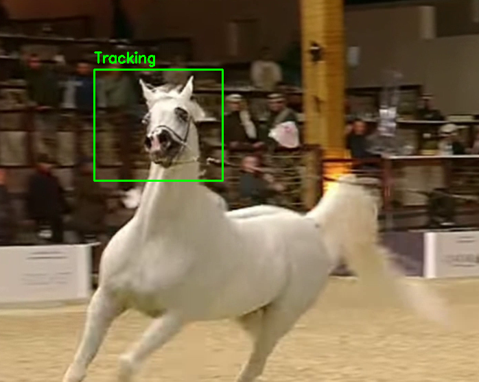

#  Object Tracking using OpenCV - Arabian Horse

This project demonstrates real-time object tracking using OpenCV in Python. The target is an Arabian horse moving across the frame in a sample video. The tracking is achieved using built-in OpenCV tracking algorithms.

##  Project Structure

```
opencv/
│
├── object_tracking.py        # Main Python script for tracking
├── sample_video.mp4         # Sample video used for tracking
└── README.md                 # This file
```

##  Tools & Environment

- **Language:** Python 3.10
- **Libraries:** OpenCV (cv2)
- **Environment Manager:** [Anaconda](https://www.anaconda.com/)
- **IDE:** Visual Studio Code

---

##  Installation & Setup

1. **Clone the repository:**
   ```bash
   git clone https://github.com/your-username/opencv-object-tracking.git
   cd opencv-object-tracking
   ```

2. **Create and activate a conda environment (optional but recommended):**
   > If you prefer using the `base` environment, skip this step.

   ```bash
   conda create -n object-tracker python=3.10
   conda activate object-tracker
   ```

3. **Install OpenCV:**
   ```bash
   pip install opencv-python
   ```

---

##  How to Run

Make sure you are inside the `opencv/` directory and the video file (`sample_video.mp4`) is present.

Run the script using Python:

```bash
python object_tracking.py
```

A window will open showing the video. You will:
1. Use your mouse to draw a bounding box around the horse.
2. Press **ENTER** or **SPACE** to start tracking.

The tracker will follow the horse through the video using OpenCV's `cv2.TrackerCSRT_create()` method.

---

##  How It Works

- The video is read frame by frame.
- You manually select the Region of Interest (ROI) in the first frame.
- OpenCV uses the **CSRT Tracker** to follow the selected object through the rest of the video.
- A rectangle is drawn around the horse in real-time to visualize tracking.

---

##  Sample Output

> Here's a screenshot of the tracking in action:



---

##  Notes

- The project was tested using **Anaconda base environment**.
- Works best with high-quality videos where the object is not obstructed or moving too fast.
- Other trackers available in OpenCV include: KCF, MIL, MOSSE, etc.


